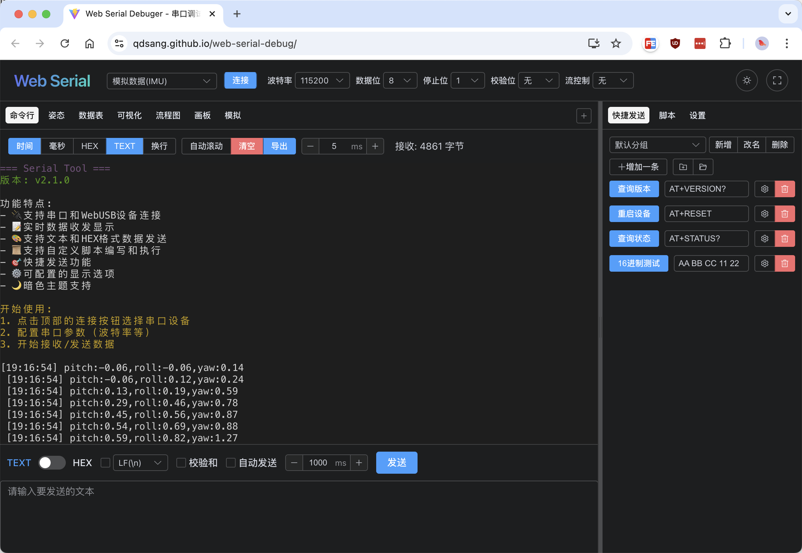
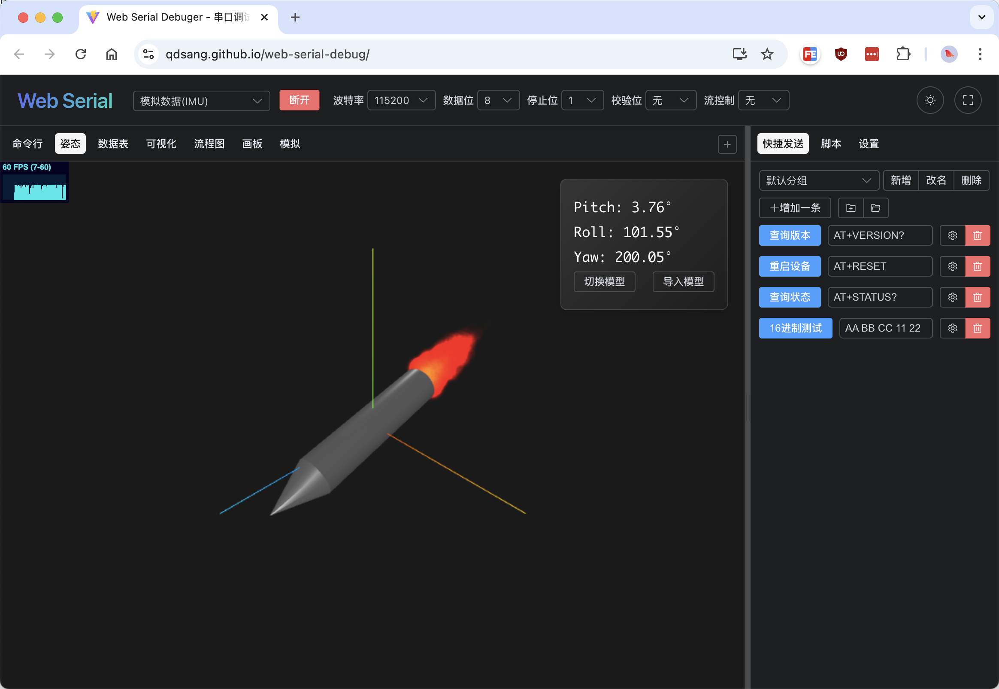
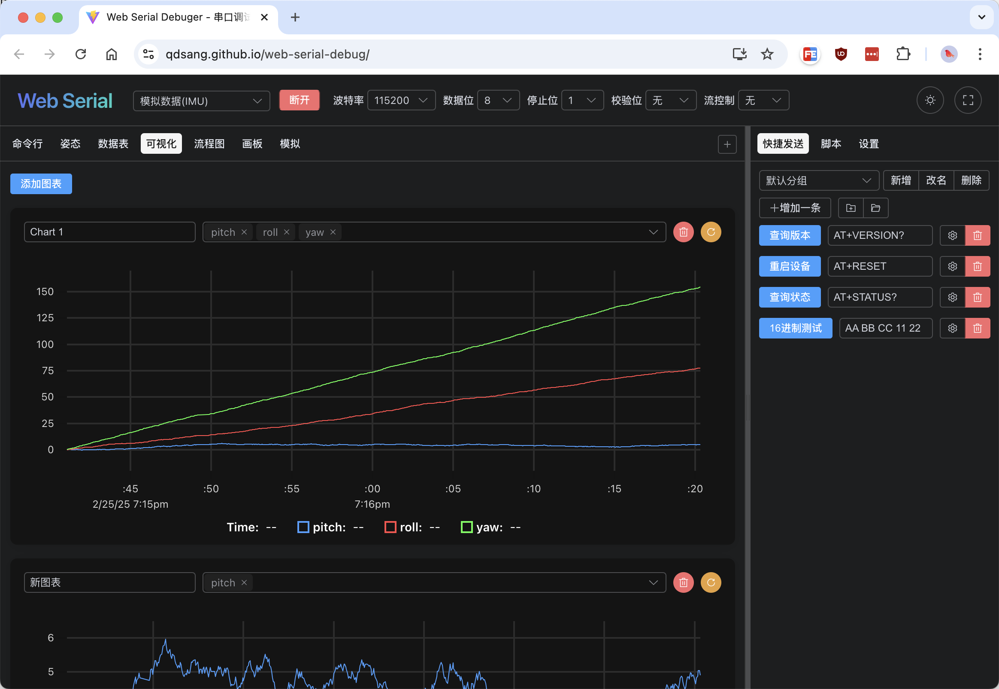

# [Web Serial Debugger](https://qdsang.github.io/web-serial-debug/)

基于 Web 的串口调试工具。 [https://qdsang.github.io/web-serial-debug/](https://qdsang.github.io/web-serial-debug/)

## Demo

<table>
<tr>
    <td></td>
    <td></td>
    <td></td>
</tr>
</table>


## 功能特点
```
┌─────────────────────────────────────────────────────────┐
│                       BUS Tool                          │
├─────────────────────────────────────────────────────────┤
│  🔌 连接层          │  📡 协议层        │  📊 数据层   │
│  ├─ 串口            │  ├─ 自定义协议    │  ├─ 实时数据  │
│  ├─ WebUSB          │  ├─ JSON 解析     │  ├─ 历史存储  │
│  ├─ 蓝牙            │  ├─ HEX 解析      │  ├─ 数据导出  │
│  ├─ WebSocket       │  ├─ CSV 解析      │  └─ 数据计算  │
│  ├─ ST-Link/DAPLink │  └─ (可扩展)      │              │
├─────────────────────────────────────────────────────────┤
│  📟 调试功能         │  📈 可视化功能    │  ⚙️ 工具     │
│  ├─ 发送/接收       │  ├─ 串口终端      │  ├─ 快捷指令  │
│  ├─ 脚本自动化      │  ├─ 数据表格      │  ├─ 脚本编辑  │
│  ├─ 协议解析        │  ├─ 实时图表      │  ├─ 协议配置  │
│  └─ 日志记录        │  ├─ 3D 姿态       │  └─ 主题设置  │
│                     │  ├─ 流程图        │              │
│                     │  └─ 模拟仿真      │              │
└─────────────────────────────────────────────────────────┘
```

## 脚本功能
可以编写JavaScript脚本来实现自动化操作，支持以下API：
- `sendText(text)` - 发送文本数据
- `sendHex(hex)` - 发送HEX格式数据
- `sleep(ms)` - 延时指定毫秒数

## 开发环境要求

- Node.js >= 18.0.0
- 支持 Web Serial API 的现代浏览器（如 Chrome、Edge）

## 编译

```bash
# 安装依赖
yarn install

# 启动开发服务器
yarn dev

# 构建生产版本
yarn build

# 预览生产版本
yarn preview
```

## 参考

https://github.com/devanlai/webstlink  
https://v2.tauri.app/zh-cn/start/  
https://github.com/mateosolinho/AeroTelemProc_VidData/tree/main  
https://github.com/Serial-Studio/Serial-Studio  
https://github.com/klonyyy/MCUViewer  


## 许可证

MIT License
